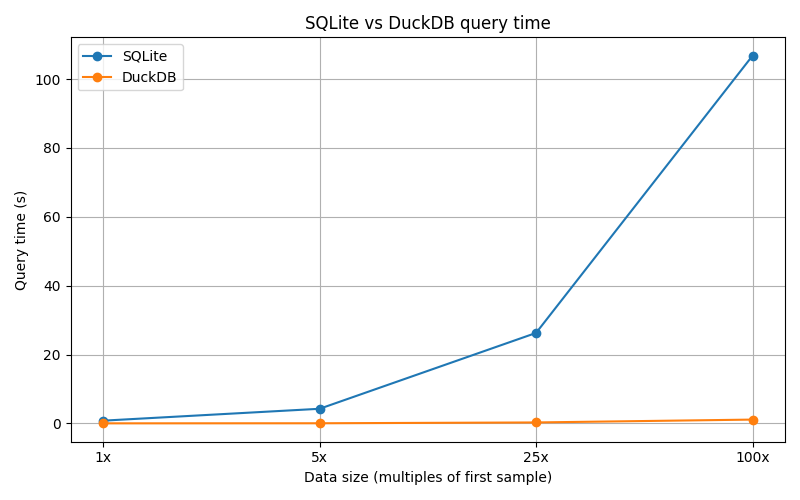

# duckdb_compare — 報告 / Report

## 簡介 / Overview
本專案包含 `duckdb_compare.py`，用以比較 SQLite（row-store）與 DuckDB（columnar）在 OLAP 聚合查詢上的效能差異，資料為合成且可重現的交易資料。

This repository contains `duckdb_compare.py`, a script to compare OLAP aggregation query performance between SQLite (row-store) and DuckDB (columnar) using synthetic, reproducible transaction data.

## 資料結構 / Data schema
- `purchase_id`: integer (unique id)
- `year`: integer (2020..2026)
- `supplier`: string (Supplier_1..Supplier_50)
- `item_category`: string (Raw Material | Equipment | Chemical | Logistics)
- `quantity`: integer
- `unit_price`: float
- `purchase_amount`: float
- `department`: string (Fab 12 | Fab 15 | Fab 18 | HQ)
- `status`: string (Completed | Pending | Cancelled)

## 資料生成方式 / How data is generated
- 使用 `chunk_generator(total_rows, chunk_size, seed=42)` 分塊產生資料。
- 使用固定種子（seed）以確保可重現性。
- 分塊能避免一次載入全部資料造成大量記憶體壓力。

Data is produced in chunks by `chunk_generator(total_rows, chunk_size, seed=42)`, using a fixed random seed for reproducibility and chunking to limit memory use.

## 測試內容 / What the script measures
- 將相同資料載入記憶體中的 SQLite 與 DuckDB。
- 執行聚合查詢：

  SELECT year, supplier, SUM(purchase_amount) as total_amount, AVG(purchase_amount) as avg_amount
  FROM purchases
  GROUP BY year, supplier
  ORDER BY year, total_amount DESC

- 計量的為查詢執行時間（wall-clock）。

It populates both an in-memory SQLite database and an in-memory DuckDB database with identical rows and runs the aggregation query above; measured times are the wall-clock query execution time.

## 使用說明 / Usage
- 基本執行：

```bash
python duckdb_compare.py
```

- 自訂測試大小（範例）：

```bash
python duckdb_compare.py --sizes 1000000 10000000 100000000 --chunk-size 1000000 --run-large
```

注意：為避免意外執行巨量測試，`--run-large` 需要被顯式指定才能執行 >= 100,000,000 筆。

Note: `--run-large` must be specified to run sizes >= 100,000,000 to avoid accidental heavy runs.

## 注意事項 / Caveats
- 測試使用的是記憶體資料庫（:memory:），不含磁碟 I/O。
- SQLite 並非為欄式 OLAP 最佳化；DuckDB 為欄式分析引擎。
- 實際結果會依機器資源、Python 與套件版本、資料分佈不同而異，請在目標環境重測驗證。

This benchmark uses in-memory databases (no disk I/O). SQLite is not optimized for columnar OLAP workloads; DuckDB is. Results depend on machine resources, Python and package versions, and data distribution—re-run in your target environment for validation.

## 我可以幫忙的事 / Next steps I can do for you
- 執行更大規模測試（例如 100M），需更多時間與記憶體。
- 將測試結果存成 CSV / 圖表報告。
- 加入更複雜的查詢或真實資料測試。

If you'd like, I can run larger tests (e.g. 100M), save timing outputs to CSV, or add more complex queries or real-data benchmarks.

## 結果 / Results

下圖為本次基準測試（等距倍數 x 軸）：



測試數據已存於 [timings.csv](timings.csv)。以下為重點數值：

| Rows | SQLite (s) | DuckDB (s) | Speedup |
|---:|---:|---:|---:|
| 1,000,000 | 0.793 | 0.015 | 51.36x |
| 5,000,000 | 4.244 | 0.038 | 111.40x |
| 25,000,000 | 26.270 | 0.274 | 95.93x |
| 100,000,000 (extrap.) | 106.770 | 1.104 | 96.70x |

註：前三個點為實測結果；100,000,000 為基於測得點的外推值（線性回歸）。結果僅供參考，實際效能會依硬體與資料分佈而異。

The plot above uses equal-spaced x-axis labels (multiples of the first sample) to better show relative scaling. The three measured points are listed; the 100M row is an extrapolation from the measured points (linear fit). Real-world results depend on machine resources and data distribution—re-run on target hardware for validation.

